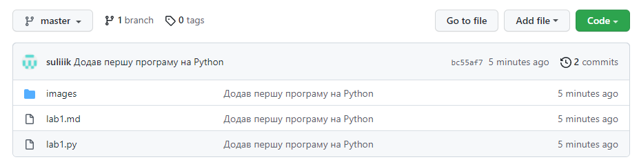

Львівський національний університет природокористування

Факультет механіки, енергетики та інформаційних технологій

Кафедра інформаційних технологій

Звіт з лабораторної роботи №2.1

на тему: 
 # Твірні Шаблони

Виконав: студент групи ІТ-31 Сулятицький Максим

Перевірив: Татомир А. В.

**Мета роботи:** 
Ознайомитися з твірними шаблонами та їх застосування на практиці.

https://mermaid-js.github.io/mermaid/#/
 
 ## Завдання
1. Короткий теоретичний опис групи твірних шаблонів.
2. Опис вибраного шаблону.
3. Приклад коду.

 ## Хід роботи

1. Твірні шаблони (англ. Creational patterns) — це шаблони проєктування, що абстрагують процес побудови об'єктів. Вони допоможуть зробити систему незалежною від способу створення, композиції та представлення її об'єктів.

    

2. Встановлюю Git.

    

3. Відкриваю Git Bash та у створеній мною папці ініціалізую репозиторій Git ввівши наступну команду.

        git init

4. В редакторі коду створюю новий файл та записую у нього код тестової програми. Зберігаю файл у папці "github" у директорії репозиторію.

    

5. Запускаю створений файл у командному рядку:

        python 'lab1.py'

    

6. Зберігаю зміни в репозиторії. Для цього спочатку додаю усі нові файли до списку відстежуваних:

        git add *

    Створюю новий запис в історії змін репозиторію. Вказую короткий та зрозумілий опис змін у назву.

        git commit -m "Додав першу програму на Python"

    Аргумент **-m** каже системі контролю версій, що після цього йде повідомлення, пов'язане із зміною.

    

7. Відправляю репозиторій у віддалене сховище (в данному випадку Github). Спочатку створюю репозиторій у своєму профілі Github та копіюю посилання на нього.

8. Додаю віддалене сховище до локального репозиторію:

        git remote add origin https://github.com/suliiik/OOP_sulik.git

    * **origin** служить назвою віддаленого репозиторію. Назва може бути довільною.

9. Відправляю усі зміни до віддаленого репозиторію:

        git push --set-upstream origin master

    * **master** - ім'я основної гілки проекту.

    

10. Переходжу за посиланням репозиторію та перевіряю наявність відправлених з локального репозиторію файлів.

    

**Висновок:** під час виконання лабораторної роботи я ознайомився з інструментарієм розробки веб-додатків та вивчив основи роботи із системою контролю версій Git.