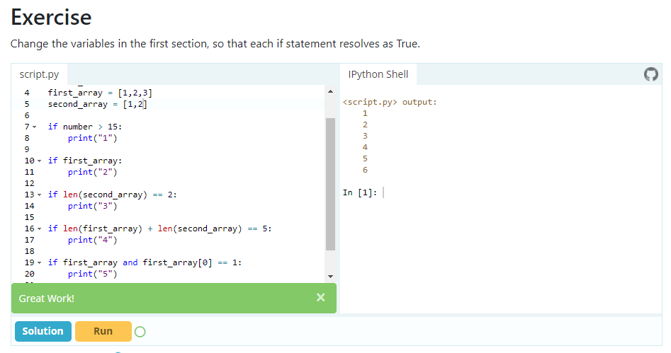
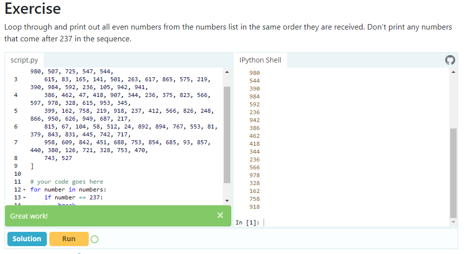

Звіт з лабораторної роботи №3
на тему: 

# Основи структурного програмування в Python 3

Виконав: ст. групи ІТ-31 Сулятицький Максим

Перевірив: Татомир А. В.

**Мета роботи:** ознайомлення основними прийомами структурного програмування у Python 3.

## Завдання
1. Засвоїти суть структурного програмування.
2. Навчитися використовувати умовні оператори
3. Познайомитися з операторами булевої логіки в Python 3.
4. Навчитися проектувати складні умови.
5. Опанувати методи роботи з циклами. Навчитися визначати доцільність
застосування різних типів циклів залежно від поставленої задачі.
6. Розв’язати приклади згідно виданих завдань.

## Хід роботи
1. Опрацьовую матеріал щоодо структурного програмування та умовних операторів.
2. Знайомлюсь з булевими операторами.
4. Засвоюю проектування складних умов.
5. Виконую завдання:

5. Опановую методи роботи з циклами.

**Висновок:** Під час виконання лабораторної роботи я засвоїв суть структурного програмування, навчився використовувати умовні оператори та проектувати складні умови.
